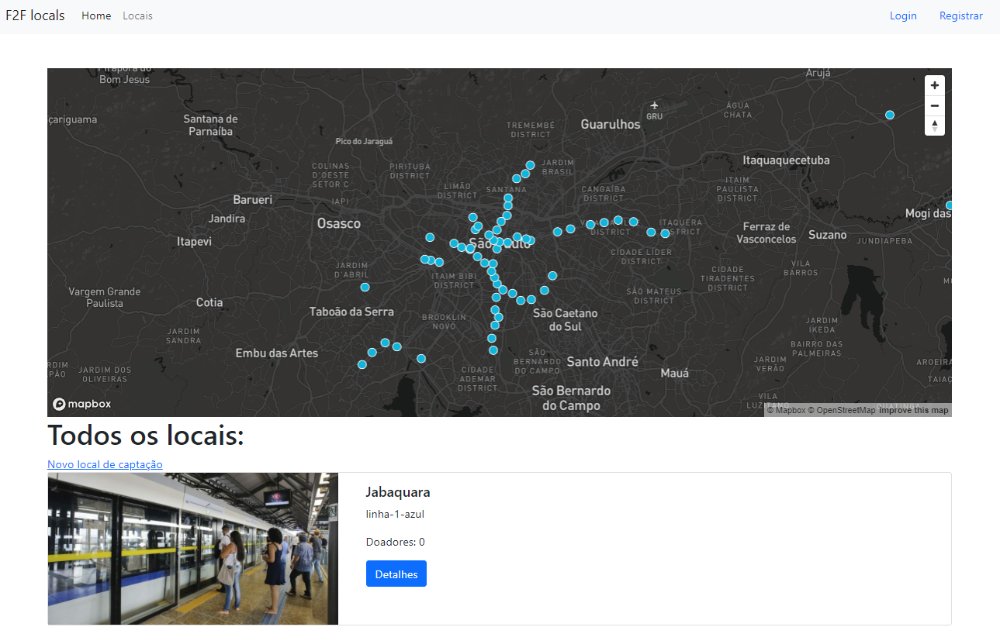

# The Web-Developer Bootcamp 2021

## F2FLocals

Essa é uma aplicação desenvolvida durante o bootcamp ["The Web-Developer Bootcamp 2021"](https://www.udemy.com/course/the-web-developer-bootcamp/) de Colt Steele.

A aplicação tem como objetivo listar locais de captação para a modalidade Face to Face de organizações não governamentais e criar um log organizado e visual de áreas positivas de captação.



## Features

Os usuários são capazes de criar uma conta, adicionar novos locais de captação e avaliar locais de captação que já estejam disponíveis com um comentário e uma nota. Todos os locais de captação mantém um número de doadores que pode ser alterado pelo criador do local e pode ser visto pelo mapBox através de um clique.

## Rodando na máquina

1. Você irá precisar instalar o mongodb.
2. Você irá precisar de uma conta na cloudnary
3. Você irá precisar de um token da MapBox
4. Crie um arquivo .env na pasta root do projeto com as seguintes informações:

```
CLOUDNARY_CLOUD_NAME=<'NOME'>
CLOUDNARY_KEY='<SUA_KEY>'
CLOUDNARY_SECRET='<SEU_SEGREDO>'
MAPBOX_TOKEN='<SEU_TOKEN>'
DB_URL=<'SUA_URL'>
```

5. Com seu banco de dados rodando, comece o app.js com

```
npx nodemon app.js
```

6. Vá para o [localhost:3000](http://localhost:3000/).
